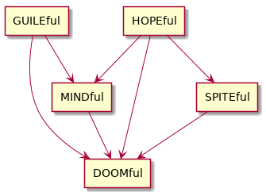

# What is **hARMful**?
**hARMful** is a project aimed at making a whole experience for programming video games and interactive 2D/3D applications. The first goal was to develop such applications on Raspberry Pi but it is intended for PC as well.

It stands for **Handy, Adapted to Raspi Multimedia and Fast Utilities Libraries**.
It also makes a joke with the Raspberry Pi ARM CPU. Basically the project was landed for a video game where player was projected in a **hARMful** environment.

The project is composed of different _little_ libraries (called _Extensions_) that can be used independently one of each other. You can even use them in combination of other external third-parties.
The main aim is to provide and share a base to generate all the applications the developers want to make. A second aim is to avoid as far as possible useless dependencies. In that way, the little the libraries use other libraries, the better it is, because it can become very tricky to manage a lot of dependencies on a such project!
Thus, the libraries of the **hARMful** project only have dependencies between each of them when needed.

The best way to explain the concept of the **hARMful** libraries is the KISS principle: **Keep It Simple, Stupid!**

The following subparts present the different libraries of the **hARMful** project.
Some additional libraries may be created for the future needs.

## DOOMful
It groups **Debugging and Oriented-Object Modules**.
Those utilities are used by all the other libraries. For example, it includes threads management to easily and properly end the application on fatal error. It provides some other features as thread-safe console and logging system to output messages.
It includes typed exceptions and some implementations of OOP deisgn patterns.

## MINDful
The **Mathematics Interface to New Developments** is used to manage matrix as OpenGL did before recent releases. It means that users do not have to set tricky things to make their models rotate, translate or scale for example.

It provides some functions with best accuracy VS the ones with best speed.
Moreover, it provides high performance features thanks to [SSE2 and NEON](https://en.wikipedia.org/wiki/SIMD).

## GUILEful
It is a **Graphic User Interface Low-level Engine**. This one provides basic abstract classes to generate a GUI. As it does not depend on extra library to display graphics, it is intended to be overloaded through a full implementation by calling the wanted rendering library or engine.

## SPITEful
It is the extension intended for **Saving and Parsing Images, Texts and Extra**.
As its name says, it is an extension to load pictures as PNG, JPEG... plus some other types of common formats (binary or ASCII).

## HOPEful
It stands for **Handy OpenGL and Physics Engines**.
It displays 3D elements on screen. It only requires OpenGL and specific Raspberry Pi APIs (not on PC). An external physics engine may be linked to the rendering.
