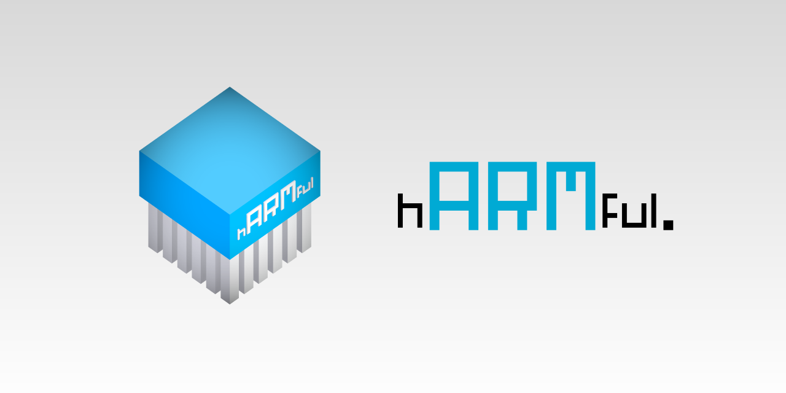

 

**hARMful** is a project aimed at making a whole experience for programming video games and interactive 2D/3D applications.

> Learn more and read the documentation on [https://dcarlus.github.io/hARMful/](https://dcarlus.github.io/hARMful/).

## Repository
The repository is structured in different parts:
-   **Libraries**: the source code of the libraries that compose the project;
-   **Softwares**: some demos to show how to use the libraries and their capabilities;
-   **Tools**: some internal tools developed to help creating the libraries. They are not required to use the library nor to be integrated into the applications;
-   **UnitTests**: unit tests to check that the different classes and modules are working as expected, without regressions. The unit tests use a home-made build system. They are run at each commit through the continuous integration;

## Dependencies
### HOPEful (OpenGL rendering)
-   [GLFW 3.2.1](https://github.com/glfw/glfw) (for window and inputs)
-   [GLEW 2.1.0](https://github.com/nigels-com/glew) (for modern OpenGL functions)
-   [Assimp 5.1.0](https://github.com/assimp/assimp) (for importing 3D file models)
-   Hardware supporting OpenGL 4.5 or higher is required

### MINDful (mathematics tools)
-   A "modern" Intel/AMD CPU with, at least, SSE2 support is required
-   SSE4 support is recommanded for improved performances
-   ARM CPUs with NEON are not yet supported

### SPITEful (multimedia files management)
-   [libpng 1.6.37](https://github.com/glennrp/libpng)
-   [libjpeg-turbo 2.0.2](https://github.com/libjpeg-turbo/libjpeg-turbo)

## Compilation
### GNU/Linux
#### Requirements
- CMake 2.8.12 or above;
- A C++17 compliant compiler is required, `g++9` and above is advised.

#### Optional tools
- Conan (you can install conan with your package manager or using `pip`).

#### Build steps
Install the requirements on your system.

:exclamation: You can either choose to install the dependencies from your distribution package manager, or let Conan select the right libraries from its own repository. Just build the project and CMake will select the right ones according to what is installed on your system.

To compile on a GNU/Linux system, enter the `Library` folder and type `./build.sh` in a command prompt. It will generate the `.so` files.

### Microsoft® Windows™
:warning: The compilation of **hARMful** on Microsoft® Windows™ is still work in progress! :warning:

#### Requirements
- [CMake 2.8.12](https://cmake.org/download/) or above;
- [Visual Studio 2019](https://visualstudio.microsoft.com) and above. Notice that Visual Studio Community is free to use. **Previous versions of Visual Studio cannot build the project!**
- [Python 3](https://www.python.org/downloads/)

#### Build steps
- Install all the requirements. Add both CMake and Python to the `PATH` environment variable.
- In a PowerShell or any other CLI, install Conan by typing the `pip install conan` command.
- Open the CMake GUI:
    - Select the **hARMful** `Library` directory for both "source code" and "build" folders.
    - Press the "Configure" button, check that Visual Studio 2019 is selected and use the `x64` platform in combobox. Press "Finish" when it's done. Wait until the configuration is complete (it can takea while if the dependencies have to be downloaded by Conan).
    - Press the "Generate" button then close CMake.
- Open the generated `hARMful.sln` file with Visual Studio 2019. Compile the projects in either Release or Debug mode. You can see warnings above missing PDB files, it just means the dependencies have no debug informations; the compilation of **hARMful** is not impacted by this.

### Mac™ OS
Not officially supported.
