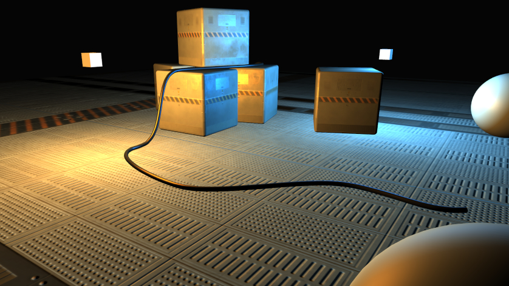

#  hARMful

**hARMful** is a project aimed at making a whole experience for programming video games and interactive 2D/3D applications.

hARMful is a young project, leaded by a single developer. It evolves slowly but many features are expected.
Some of them are already implemented and a demonstration video is available. A "✗" symbol indicates that the feature is not yet implemented; a "✓" symbol is used to signal non-graphic features that are implemented.

## Features of HOPEful
- Architecture based on the [Entity-Component-System pattern](https://en.wikipedia.org/wiki/Entity_component_system)
- Rendering process based on a [framegraph](https://www.ea.com/frostbite/news/framegraph-extensible-rendering-architecture-in-frostbite) to handle render passes
    - Render to several viewports [[Demo](https://www.youtube.com/watch?v=6DtnK6dwXX4)]
- Simple Phong material [[Demo](https://www.youtube.com/watch?v=12xEEnEk020)]
- Texture material [[Demo](https://www.youtube.com/watch?v=cw8zRw-JgJs)]
- Normal and specular mapping [[Demo](https://www.youtube.com/watch?v=lG_GHQbIHv0)]
- Alpha channel supporting materials (✗)
- Order-independent transparency (✗)
- Physics based rendering materials (✗)
- Cascade shadow mapping (✗)
- Forward rendering (✓)
- Support of deferred rendering (✗)
- Post-rendering effects:
    - Anti-aliasing (✗)
    - Ambient occlusion (✗)
    - Bloom (✗)
    - Depth of Field (✗)
    - Many others...
- Uniform Buffer Objects (✓)
- Mesh import using ASSIMP (✓)
- Mesh instancing (✗)
- Frustum culling (✗)
- Animations (✗)
- Cube maps [[Demo](https://www.youtube.com/watch?v=ySbokTOJKbk)]
- Input management (keyboard, mouse, joypad) (✗)
- [Bullet physics engine](https://github.com/bulletphysics/bullet3) integration (✗)

## Features of MINDful
- SIMD implementations:
    - SSE (Intel/AMD) (✓)
    - NEON (ARM) (✗)
- Vectors 2D, 3D and 4D with common operations (✓)
- Quaternions with common operations (✓)
- Matrices 3x3 and 4x4 with common operations for 3D graphics applications (✓)

## Features of SPITEful
- Load text files (✓)
- Load binary files (✓)
- Load images:
    - PNG (✓)
    - JPEG (✓)
    - TGA (✗)

## Features of HOPEful
- Log system (✓)
- Profiling tool (✓)
- Translation abstraction tool:
    - Linux (✓)
    - Windows (✗)
- Random numbers (integer, floats) generation (✓)
