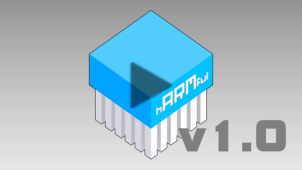
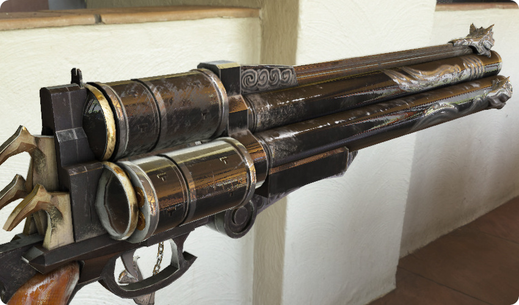
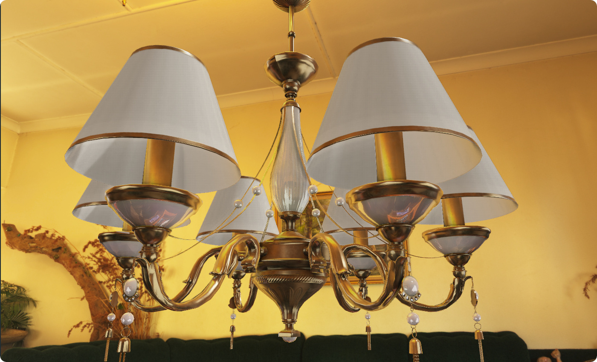
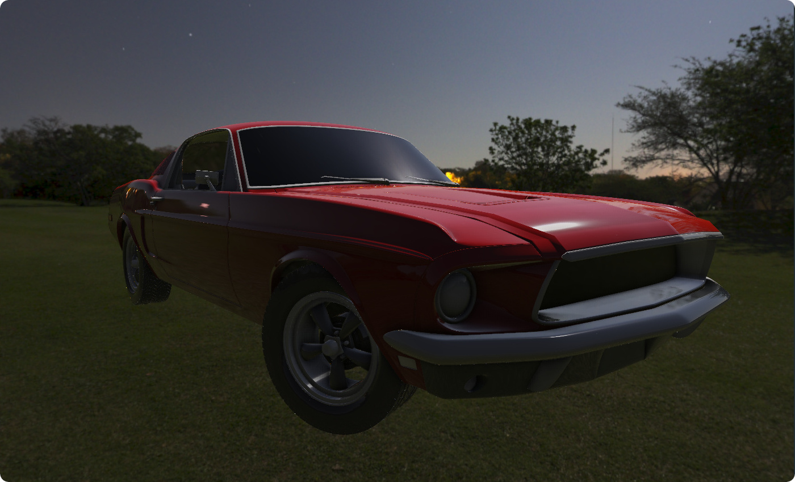

**hARMful** is a project aimed at making a whole experience for programming video games and interactive 2D/3D applications.

hARMful is a young project, leaded by a single developer. It evolves slowly but many features are expected.
Some of them are already implemented and a demonstration video is available. A "✗" symbol indicates that the feature is not yet implemented; a "✓" symbol is used to signal non-graphic features that are implemented.

 
<a href="https://www.youtube.com/watch?v=cxUawRNoaf8" target="_blank" title="hARMful demo (video)">https://www.youtube.com/watch?v=cxUawRNoaf8</a>

## Features
### Features of HOPEful
- Architecture based on the [Entity-Component-System pattern](https://en.wikipedia.org/wiki/Entity_component_system)
- Rendering process based on a [framegraph](https://www.ea.com/frostbite/news/framegraph-extensible-rendering-architecture-in-frostbite) to handle render passes
    - Render to several viewports [[Demo](https://www.youtube.com/watch?v=ElPDwyt3TtE)]
- Blinn-Phong material [[Demo](https://www.youtube.com/watch?v=WdcBg3hA-xQ)]
- Diffuse, normal and specular maps material [[Demo](https://www.youtube.com/watch?v=KRRrB-G3OOY)]
- Alpha channel supporting materials (✗)
- Order-independent transparency (✗)
- Physics based rendering materials (✗)
- Cascade shadow mapping [[Demo 1](https://www.youtube.com/watch?v=8Q3Ci3c_1Pg)] [[Demo 2](https://www.youtube.com/watch?v=BIaklMRR1RQ)]
- Render passes management [[Demo](https://www.youtube.com/watch?v=_oQXAGGpcu8)]
- Support of deferred rendering (✓)
    - Compute scene objects position from depth (✓)
    - Compute normals in a spheremap transform (✓)
- Post-rendering effects:
    - Anti-aliasing (✓)
    - Screen-Space Ambient Occlusion [[Demo](https://www.youtube.com/watch?v=-YB91aXd1RY)]
    - Ground-Truth Ambient Occlusion (✗)
    - Bloom (✗)
    - Depth of Field (✗)
    - Many others...
- Uniform Buffer Objects (✓)
- Mesh import using ASSIMP (✓)
- Mesh instancing (✗)
- Frustum culling (✗)
- Quadtree (✗)
- Animations (✗)
- Cube maps (✓)
- Equirectangular to cubemap conversion [[Demo](https://www.youtube.com/watch?v=GDw-JpYGAx8)]
- Fog (✓) [[Demo](https://www.youtube.com/watch?v=2GihYR76Jzw)]
- Input management (keyboard, mouse, joypad) (✗)
- Scripting (✗)
- [Bullet physics engine](https://github.com/bulletphysics/bullet3) integration (✗)

[Fullscreen](./assets/images/hARMful_big.jpg) - _Model by [Andrew Maximov](https://artisaverb.info/Cerberus.html)_

### Features of MINDful
- SIMD implementations:
    - SSE (Intel/AMD) (✓)
    - NEON (ARM) (✗)
- Vectors 2D, 3D and 4D with common operations (✓)
- Quaternions with common operations (✓)
- Matrices 3x3 and 4x4 with common operations for 3D graphics applications (✓)

### Features of SPITEful
- Load text files (✓)
- Load binary files (✓)
- Load images:
    - PNG (✓)
    - JPEG (✓)
    - TGA (✓)
	- HDR (✓)
    - DDS (✗)

### Features of HOPEful
- Log system (✓)
- Profiling tool (✓)
- Translation abstraction tool:
    - Linux (✓)
    - Windows (✗)
- Random numbers (integer, floats) generation (✓)

_
Model by [Kirill Sannikov](https://3dmodelhaven.com/model/?m=Chandelier_01)_

## Roadmap
After the release of the version 1.0, the following versions will be prepared by specific features.
The development time for each of them will vary, depending on the content of the feature and the difficulties to develop it. Some features may be faster than others to be accomplished. Moreover, intermediary versions can be included to fix bugs.

A study on this development time will be done to provide an estimated release date.

### Version 1.0
The first version of hARMful is waited for mid-2020. It is not yet well evolved and it still is a "baby" engine as it contains the base of the project structure and rendering features. Some advanced features are integrated as well to test the capability of the engine to evolve as wanted in the future.
* Support of GNU/Linux and Windows 10
* Intel SSE support for mathematics
* Image loader (JPEG/PNG)
* Support of OpenGL 4.6 (only) with basic 3D features:
    - Mesh importer
    - Blinn-Phong based rendering
    - Multitexturing (albedo, normal and specular maps)
    - Cubemaps
    - Lighting (directional and point lights)
    - Hard shadows on directional lights
    - Screen-space ambient occlusion

### Version 2.0 [Physics-based rendering]
Blinn-Phong materials are deprecated and huge change in scene tree are made (tree of transforms instead of entities).
This version adds instead a much more realistic rendering.
* Support of PBR materials
* Support of image-based lighting
* Support of HDR
* Parallax mapping

### Version 2.1 [Lighting and shadows]
It continues for graphics improvements with a much more realistic lighting.
* Support of soft shadows (Screen Space Percentage-Closer Soft Shadows)
* Point light shadows
* Spot light and their shadows
* Ground-truth ambient occlusion

### Version 2.2 [Transparency]
Mainly oriented towards the integration of transparent materials and their related effects.
* Order-independent transparency
* Alpha mapping
* Transparent materials (blending and clipping)
* Refraction and reflection of cubemaps

### Version 2.3 [Performances - Step #1]
A first step for improving performances of the engine.
* Manage static and dynamic objects on rendering

### Version 2.4 [Interactions]
A version to add user interactions in the engine. It begins bringing life with physics, in order to continue this effort in the next version.
* [v1.4a] User inputs
    * Keyboard + mouse
    * Controlers
* [v1.4b] Integration of the Bullet physics engine (rigid bodies)

### Version 2.5 [Animation]
Animated meshes and animations following user defined tracks.
* Motion based on defined paths (curves)
* Interpolation types
* IK mesh animation (bones)

### Version 2.6 [Performances - Step #2]
A second step for improving performances of the engine.
* Octrees
* Frustum culling

### Version x.y [Planned features]
* Scripting (Python)
* Sky generation in GLSL
* Global illumination
* Radiosity
* Use of the SPIR-V language for shaders
* Support of the Vulkan API
* ...

_
Rendered from a FBX (not PBR compliant) - Model by [Tryder](https://www.blendswap.com/blend/16609)_
